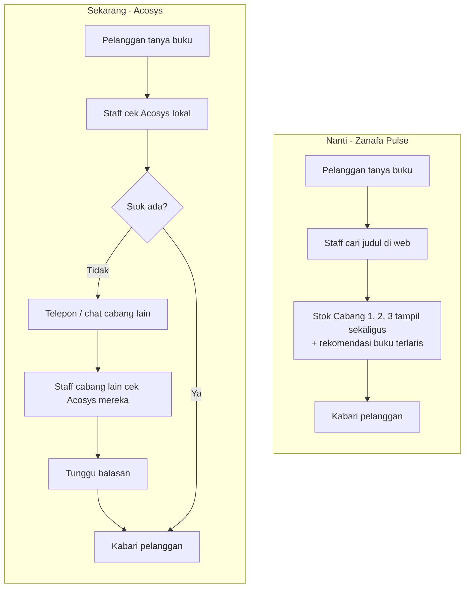
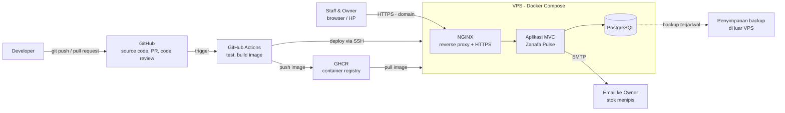
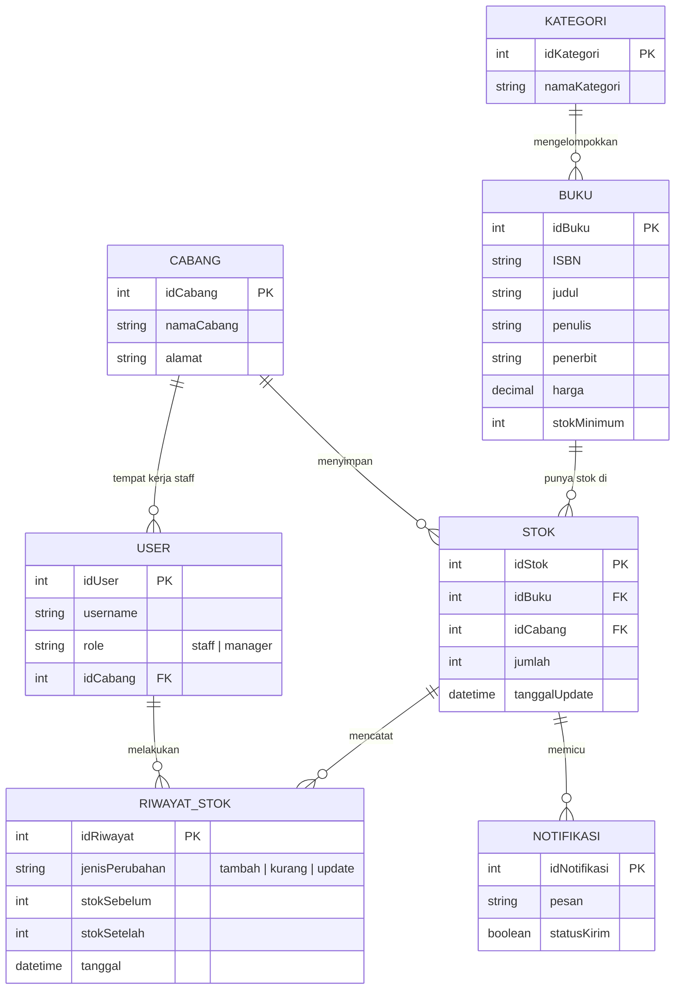
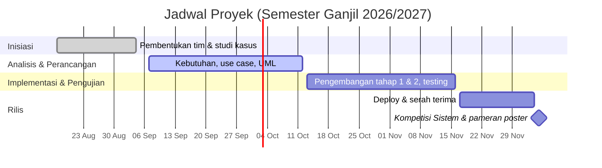

# Zanafa Pulse

**Stok tiga cabang, dalam satu layar.**

Sistem inventaris buku berbasis web untuk **Toko Buku Zanafa** — PT. Zanafa Group Indonesia, Pekanbaru.

[Masalah](#masalah-yang-diselesaikan) ·
[Solusi](#dari-as-is-ke-to-be) ·
[Fitur](#fitur-mvp) ·
[Arsitektur](#arsitektur-sistem) ·
[Model Data](#model-data) ·
[Roadmap](#roadmap) ·
[Tim](#tim)

---

> [!NOTE]
> Proyek ini masih di **fase analisis & perancangan**. Belum ada kode aplikasi. Arsitektur infrastruktur sudah ditetapkan (lihat [Arsitektur Sistem](#arsitektur-sistem)), tetapi bahasa dan framework MVC aplikasinya belum dipilih. Implementasi dijadwalkan mulai pertengahan Oktober 2026.

## Masalah yang Diselesaikan

Toko Buku Zanafa punya tiga cabang, tapi data stoknya terkunci di **Acosys V4.4.57** — aplikasi desktop lama (era Windows XP/7) yang hanya bisa dibuka dari jaringan lokal toko.

| Masalah | Dampaknya |
|---|---|
| Acosys hanya bisa diakses dari LAN toko | Owner yang jarang di toko **tidak bisa memantau stok dari luar** |
| Tidak ada fitur cek stok antar cabang | Staff harus **telepon/chat cabang lain** setiap kali buku habis, pelanggan menunggu |
| Data tersimpan di satu komputer | **Risiko kehilangan data** kalau perangkat rusak |
| Backup & laporan bulanan disusun manual | **Waktu terbuang** untuk rekap yang seharusnya otomatis |
| Tampilan usang dan tidak ramah pengguna | Karyawan baru **butuh waktu lama** untuk belajar |

## Dari As-Is ke To-Be

Skenario paling sering terjadi: pelanggan menanyakan buku yang ternyata habis di cabang tempat ia berada.

**Tujuan utamanya:** data stok bisa diakses dari mana saja, terlihat lintas tiga cabang dalam satu tampilan, dan Owner langsung tahu kalau ada stok yang menipis — tanpa harus datang ke toko.

## Fitur MVP

| # | Fitur | Yang dilakukan |
|:-:|---|---|
| 1 | **Login & akses berbasis role** | Login username/password; Staff dan Manager/Owner diarahkan ke dashboard masing-masing |
| 2 | **Katalog buku** | Tabel berpaginasi: kode, judul, penulis, penerbit, harga, stok per cabang, dengan pencarian & filter |
| 3 | **Cek stok antar cabang** — *fitur inti* | Satu judul buku, stok di Cabang 1, 2, dan 3 ditampilkan berdampingan |
| 4 | **Kelola stok** | Tambah / kurang / update stok per cabang; stok tidak bisa negatif; setiap perubahan tercatat |
| 5 | **Buku terlaris** | Muncul saat Staff cek stok, dihitung dari riwayat stok keluar, untuk bahan rekomendasi ke pembeli |
| 6 | **Peringatan stok menipis** | Tanda peringatan di katalog & dashboard, plus **email otomatis** ke Owner berisi judul, cabang, dan sisa stok |
| 7 | **Riwayat & laporan stok** | Log semua perubahan stok, bisa difilter per cabang, rentang waktu, atau nama Staff |

### Hak Akses per Role

| Kemampuan | Staff | Manager / Owner |
|---|:-:|:-:|
| Cek stok & lihat buku terlaris | ✓ | ✓ |
| Katalog & pencarian buku | ✓ | ✓ |
| Cek stok antar cabang | ✓ | ✓ |
| Tambah / kurang / update stok | ✓ | ✓ |
| Dashboard | cabang sendiri | ketiga cabang + aktivitas terbaru |
| Riwayat & laporan stok | — | ✓ |
| Menerima email stok menipis | — | ✓ |

## Arsitektur Sistem

Alurnya dari kode sampai produksi: developer push ke GitHub, GitHub Actions menjalankan test, mem-build image Docker, lalu men-deploy ke satu VPS. Di VPS semua komponen berjalan dengan **Docker Compose**. Kubernetes sengaja tidak dipakai karena berlebihan untuk tiga cabang dan satu server.

Aplikasinya **satu aplikasi MVC (monolit)**, tidak dipecah jadi banyak service seperti *User / Project / Notification Service*. Pembagiannya mengikuti peran tim: **View** dikerjakan Frontend, **Model & Controller** dikerjakan Backend.

### Komponen yang Dipakai

Komponen dipilih seminimal mungkin dan dibagi tiga tingkat prioritas.

**Tingkat 1 — Wajib (supaya MVP bisa jalan online)**

| Komponen | Pilihan | Fungsinya di proyek ini |
|---|---|---|
| Repository | GitHub | Source code, branch per fitur, pull request & code review |
| CI/CD | GitHub Actions | Test dan build otomatis setiap push, deploy otomatis ke VPS saat merge ke `main` |
| Container | Docker + Docker Compose | Lingkungan sama persis di laptop tim dan di server |
| Server | 1 VPS | Tempat aplikasi berjalan (anggaran ±Rp150.000 untuk 2 bulan) |
| Akses luar | Domain + NGINX + HTTPS (Let's Encrypt) | Aplikasi bisa dibuka dari mana saja, menggantikan Acosys yang hanya bisa diakses lewat LAN |
| Database | PostgreSQL | Data buku, stok per cabang, user, riwayat stok |
| Email | SMTP (mis. Gmail SMTP / layanan email gratis) | Notifikasi stok menipis ke Owner |

**Tingkat 2 — Penting (supaya andal dan aman)**

| Komponen | Pilihan | Alasan |
|---|---|---|
| Container registry | GitHub Container Registry (GHCR) | Image punya versi (tag), jadi bisa **rollback** ke versi sebelumnya kalau deploy gagal |
| Backup database | `pg_dump` terjadwal, disimpan di luar VPS | Menjawab langsung masalah lama: backup Acosys manual dan hanya di satu komputer |
| Monitoring dasar | Health check endpoint + Uptime Kuma, log via `docker logs` | Tim tahu kalau aplikasi mati tanpa harus mengecek manual |
| Proteksi branch | Branch protection di `main` | Semua perubahan wajib lewat PR dan lolos CI |

**Tingkat 3 — Opsional (dipertimbangkan kalau waktu cukup)**

| Komponen | Kapan dibutuhkan |
|---|---|
| Redis | Cache katalog, antrean email untuk kirim ulang yang gagal. Untuk MVP, session & antrean cukup disimpan di PostgreSQL |
| Prometheus + Grafana + Loki | Monitoring dan dashboard log lengkap. Cukup berat untuk VPS kecil |
| Object storage (S3-compatible) | Kalau nanti ada upload gambar sampul buku. MVP tidak butuh upload file |

**Tidak dipakai:** Kubernetes, Helm, Argo CD, Terraform, RabbitMQ. Satu VPS dengan Docker Compose sudah cukup untuk skala tiga cabang, dan waktu coding hanya sekitar lima minggu.

### Alur Deploy

1. Developer membuat branch fitur, lalu membuka pull request ke `main`.
2. GitHub Actions menjalankan test. PR hanya bisa di-merge kalau test lolos dan sudah di-review.
3. Setelah merge, GitHub Actions mem-build image Docker dan mem-push-nya ke GHCR dengan tag versi.
4. GitHub Actions masuk ke VPS lewat SSH, menarik image baru, lalu menjalankan `docker compose up -d`.
5. NGINX tetap melayani lewat HTTPS. Kalau versi baru bermasalah, deploy ulang dengan tag sebelumnya.

## Model Data

Diturunkan dari class diagram di dokumen perancangan. Bisa berubah saat tech stack dan skema database final ditentukan.

Beberapa keputusan desain yang penting:

- **`STOK` adalah perpotongan `BUKU` × `CABANG`** — satu buku punya tepat satu record stok per cabang. Inilah yang membuat cek stok antar cabang cukup satu query.
- **`RIWAYAT_STOK` tidak ikut terhapus** walaupun record stok dihapus, karena berfungsi sebagai audit trail.
- **Buku terlaris dihitung dari `RIWAYAT_STOK`** dengan `jenisPerubahan = kurang`, bukan dari tabel penjualan terpisah.

## Roadmap

- [x] Project Initiation disetujui Store Manager
- [x] Analisis kebutuhan, use case diagram & deskripsi
- [x] Class diagram & sequence diagram
- [x] Menentukan arsitektur infrastruktur (Docker Compose di VPS, tanpa Kubernetes)
- [ ] Memilih bahasa & framework MVC aplikasi
- [ ] Setup Docker Compose, VPS, domain + HTTPS
- [ ] Pipeline CI/CD GitHub Actions (test → build → push GHCR → deploy)
- [ ] Backup database terjadwal & monitoring dasar
- [ ] Autentikasi, dashboard, katalog
- [ ] Cek stok antar cabang, kelola stok, riwayat
- [ ] Notifikasi email stok menipis, laporan
- [ ] Deploy & demo di Kompetisi Sistem

## Batasan Proyek

- **Waktu** — jadwal akademik 16 minggu, dengan sekitar lima minggu efektif untuk coding (Minggu 9–13).
- **Arsitektur** — wajib MVC, dikelola dengan Git, didukung CI/CD, dan di-deploy ke VPS/cloud.
- **Biaya** — tanpa budget dari klien; hanya tools dan hosting gratis atau berbiaya rendah.
- **Isolasi** — sistem berjalan di database sendiri dan **tidak menyentuh Acosys** yang sedang dipakai toko.
- **Data** — data nyata dari satu cabang dibagi menjadi tiga subset untuk mensimulasikan Cabang 1, 2, dan 3.

## Tim

**Kelompok 6, Kelas B** — Program Studi Sistem Informasi, Universitas Riau (angkatan 2023)

| Peran | Anggota | Tanggung Jawab |
|---|---|---|
| Project Manager | Doni Arman.S | Koordinasi tim & jadwal, penghubung dengan toko dan dosen |
| System Analyst | Yesi Rahma Putri Utami Siregar, Kayla Aulianissa | Analisis kebutuhan, survei, diagram UML |
| Frontend Developer | Sarwenda S.Y. Aritonang, Zahra | Antarmuka (View), integrasi ke backend |
| Backend Developer | Harits Dwi Rahmayudi | Logika sistem & database (Model, Controller) |

**Dosen pembimbing:** Al Aminuddin, S.T., M.Sc · Sonya Meitarice, M.Sc · Khairul Fajri Ilahi, S.Kom., M.Kom.

## Dokumentasi

<b>Isi folder <code>Dokumentasi/</code></b>

 

| Lokasi | Isi |
|---|---|
| `Dokumentasi/Project_Initiation/` | Project Initiation Checklist, dokumen Analisis & Perancangan Sistem |
| `Dokumentasi/Diagram/` | Use case diagram & deskripsi, As-Is / To-Be, class diagram |
| `Dokumentasi/Diagram/Sequence_PlantUML/` | 10 sequence diagram (sumber `.puml` + hasil render) |

---

Information Systems Development Project (MSI4104) · Universitas Riau · 2026

